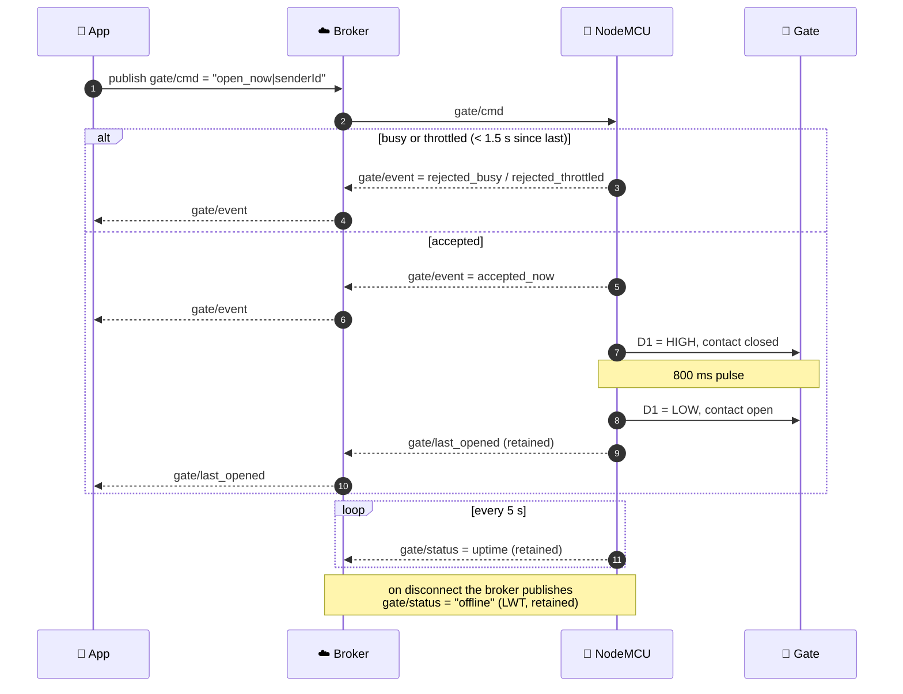
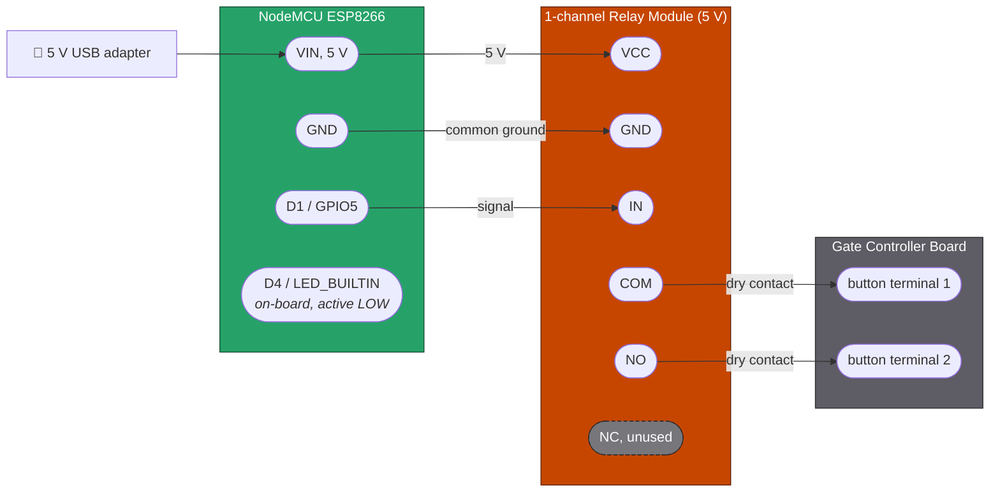

# NodemcuGateSystem

ESP8266 (NodeMCU) based remote gate opener. Talks MQTT over TLS to a HiveMQ Cloud
broker; a relay pulses the gate controller's manual-button contacts for 800 ms,
exactly like pressing the wall button.

Earlier versions of this project drove the gate through a Telegram bot
(`NodemcuGateSystem.ino`). That approach is gone: the firmware now speaks MQTT, which
gives it retained state, a last-will message and sub-second command latency.

---

## System Architecture

```mermaid
flowchart LR
    subgraph client["📱 Client"]
        APP["Phone / App<br/><i>MQTT over TLS</i>"]
    end

    subgraph cloud["☁️ HiveMQ Cloud"]
        BROKER["MQTT Broker<br/><b>:8883 TLS</b><br/><i>user + password</i>"]
    end

    subgraph device["🔌 At the gate"]
        ESP["NodeMCU ESP8266<br/>WiFiManager · PubSubClient · BearSSL"]
        RELAY["1-ch Relay 5V<br/><i>COM / NO dry contact</i>"]
        GATE["Gate Controller Board<br/><i>manual button terminals</i>"]
    end

    APP -- "publish gate/cmd" --> BROKER
    BROKER -- "gate/status · gate/event · gate/last_opened" --> APP
    BROKER -- "gate/cmd (WiFi 2.4 GHz + TLS)" --> ESP
    ESP -- "status · event · last_opened" --> BROKER
    ESP -- "D1 / GPIO5, HIGH = ON" --> RELAY
    RELAY -- "800 ms pulse" --> GATE

    style BROKER fill:#1a5fb4,stroke:#0d2f5c,color:#fff
    style ESP fill:#26a269,stroke:#124a2f,color:#fff
    style RELAY fill:#c64600,stroke:#5c2000,color:#fff
    style GATE fill:#5e5c64,stroke:#2b2a2e,color:#fff
    style APP fill:#613583,stroke:#2d174a,color:#fff
```



### Command flow



`delay:<sec>` (1 to 120) schedules the same pulse for later, `cancel` aborts a
pending delayed open, `restart` reboots the board. All are published to `gate/cmd`.

### MQTT topics

| Topic              | Direction    | Payload                                                                                                                                                                |
| ------------------ | ------------ | ---------------------------------------------------------------------------------------------------------------------------------------------------------------------- |
| `gate/cmd`         | app → device | `open_now`, `delay:<sec>`, `cancel`, `restart`, with an optional `\|<senderId>` suffix                                                                                  |
| `gate/status`      | device → app | uptime in seconds, or `offline` (LWT). Retained.                                                                                                                       |
| `gate/event`       | device → app | `accepted_now`, `accepted_delay:<sec>`, `triggered`, `cancelled`, `cancel_empty`, `rejected_busy`, `rejected_throttled`, `invalid_delay`, `restarting`, plus `\|<senderId>` |
| `gate/last_opened` | device → app | uptime in seconds at the moment the gate opened. Retained.                                                                                                             |

---

## Hardware Wiring



| NodeMCU      | Relay module | Notes                                                        |
| ------------ | ------------ | ------------------------------------------------------------ |
| `VIN` (5 V)  | `VCC`        | Relay coil needs 5 V. Do **not** feed it 3.3 V.              |
| `GND`        | `GND`        | Common ground, required.                                     |
| `D1` (GPIO5) | `IN`         | `RELAY_ON = HIGH` in `gate_config.h`.                        |
| (none)       | `COM` / `NO` | Dry contact across the gate board's manual-button terminals. |

The relay is a **momentary dry contact**. It never carries gate motor current, it
just shorts the two low-voltage button terminals for 800 ms. `NC` stays unconnected
so a power loss or reboot leaves the contact open and the gate untouched.

The on-board LED (`D4` / `LED_BUILTIN`, active LOW) doubles as a status light:
WiFiManager blinks it while connecting, and it goes solid while a gate action runs.

> **Safety.** The gate controller board is mains-powered. Only touch the low-voltage
> button terminals, with the board's power off, and verify with a multimeter that the
> pair you wire into is not carrying mains voltage. If your controller expects an
> active-LOW trigger instead of a dry contact, flip `RELAY_ON` / `RELAY_OFF` in
> `gate_config.h`. Do not rewire the relay into the motor supply.

### Active-LOW relay boards

Many cheap relay modules are **active-LOW** (`IN` pulled LOW energises the coil). If
yours clicks the moment the ESP8266 boots, swap the two defines:

```c
#define RELAY_ON  LOW
#define RELAY_OFF HIGH
```

---

## HiveMQ Cloud Setup

The free Serverless tier is enough for this project (100 connections, 10 GB/month).

**1. Create the cluster**

- Sign up at [console.hivemq.cloud](https://console.hivemq.cloud/).
- **Create New Cluster** → pick **Serverless (Free)** → choose a region close to you
  (e.g. `eu-central-1`) → **Create**.
- The cluster is ready in a few seconds.

**2. Grab the connection details**

On the cluster's **Overview** tab:

| Field          | Value                             | Goes into `gate_config.h`            |
| -------------- | --------------------------------- | ------------------------------------ |
| Cluster URL    | `<cluster-id>.s1.eu.hivemq.cloud` | `MQTT_HOST`                          |
| TLS MQTT port  | `8883`                            | `MQTT_PORT`                          |
| WebSocket port | `8884`                            | only if your app is a browser client |

**3. Create an MQTT user**

- Open **Access Management** → **Credentials** → **Add credential**.
- Username (e.g. `nodemcu`), a strong password, permission **Publish and Subscribe**.
- Save. That username/password pair becomes `MQTT_USER` / `MQTT_PASS`.

Create a *second* credential for your phone app rather than reusing the device's. If
either one leaks you can revoke it without reflashing the other.

**4. Fill in the config**

```sh
cp gate_config.example.h gate_config.h
```

Then edit `MQTT_HOST`, `MQTT_USER`, `MQTT_PASS`, `ssid` and `pass`.
`gate_config.h` is gitignored, so never commit it.

**5. Test before you flash**

HiveMQ's **Web Client** tab connects to your cluster from the browser. Log in with a
credential, subscribe to `gate/#`, and after flashing you should see `gate/status`
tick up every 5 seconds. Publishing `open_now` to `gate/cmd` from there should click
the relay, which is a good way to test the wiring before the gate is involved.

> **TLS note.** The firmware calls `secureClient.setInsecure()`, so it encrypts the
> connection but does **not** validate the broker's certificate. Fine on a home
> network; if you want real protection against a man-in-the-middle, pin HiveMQ's CA
> with `setTrustAnchors()` instead.

---

## Flashing

1. Arduino IDE → **Boards Manager** → install **esp8266** (Additional Board URL:
   `https://arduino.esp8266.com/stable/package_esp8266com_index.json`).
2. **Library Manager** → install **PubSubClient**.
3. Board: *NodeMCU 1.0 (ESP-12E Module)*. Select the port, **Upload**.
4. Serial monitor at **115200** baud shows the WiFi and MQTT handshake.

### Built-in protections

- **Throttle**: commands within 1.5 s of the previous one are rejected.
- **Busy lock**: a second command during an open cycle is rejected (`rejected_busy`).
- **Busy timeout**: if the gate stays busy for 15 s, the relay is forced off.
- **Daily restart**: the board reboots itself after 24 h of uptime, when idle.
- **LWT**: the broker publishes `offline` to `gate/status` if the device drops.

---

## License

Apache License 2.0. See [LICENSE](LICENSE).
